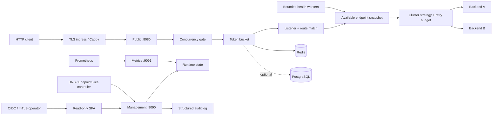

# Go HTTP load balancer

L7 HTTP reverse proxy с round-robin балансировкой, active/passive health checks, ограниченными retry, распределённым token bucket и отдельной management plane. Репозиторий содержит приложение, интерактивную техническую документацию и шаблоны production-развёртывания.

- Интерактивная документация: <https://j0es1ick.github.io/cloud_test_assignment/>
- Public data plane: `:8080`
- Internal management plane: `:9090`
- Internal health/metrics plane: `:9091`
- Локальная live-панель: `:3000`

Проект является одновременно reverse proxy и load balancer: он завершает клиентское HTTP-соединение, создаёт upstream-запрос от своего имени и выбирает backend по состоянию пула. Балансировка — политика выбора upstream; reverse proxy — механизм передачи запроса и ответа.

## Состояние проекта

Production deployment template включает:

- конкурентно-безопасный request path без глобального mutex на выборе backend;
- versioned listeners/routes/clusters config, stable endpoint ID, runtime apply/rollback и administrative draining;
- round-robin, weighted round-robin, least-request и rendezvous-hash стратегии;
- static, DNS и Kubernetes EndpointSlice discovery с последним известным рабочим snapshot;
- streaming responses, client cancellation и HTTP Upgrade/WebSocket forwarding;
- HTTP/HTTPS/TCP health checks с thresholds, jitter, cooldown и slow start;
- retries только на другой endpoint, только для разрешённых методов и с per-cluster process-local retry budget;
- passive circuit breaking и лимит параллельных запросов на backend;
- глобальную overload protection с ограниченной очередью;
- local, Redis и PostgreSQL token bucket storage;
- `fail-open`, `fail-closed` и `local-fallback` при отказе store;
- изолированную management plane, role-based credentials, bearer/mTLS identity и trusted proxy parsing;
- отдельную metrics plane, liveness/readiness, Prometheus metrics, OTLP traces, JSON access/audit logs и request ID;
- non-root/read-only контейнеры, локальный TLS edge и observability stack;
- Kubernetes/Kustomize и Helm шаблоны с тремя репликами, topology spread, rolling update, HPA, PDB и NetworkPolicy;
- k6 smoke/load/soak/spike профили;
- CI с race detector, integration tests, linters, vulnerability scans и deployment smoke test;
- выпуск multi-architecture OCI-образов с SBOM, provenance, Sigstore-подписью и GitHub attestation.

Это шаблон, а не обещание универсального SLA. Перед реальной публикацией необходимо задать целевые SLO, адреса backend-ов, managed Redis/PostgreSQL, домен, TLS secret, alert receivers и resource limits по результатам нагрузочного теста.

## Архитектура



### Порядок обработки запроса

1. HTTP server применяет header/timeouts и создаёт или сохраняет корректный `X-Request-ID`.
2. IP определяется по socket address. Входные `Forwarded`/`X-Forwarded-*`/`X-Real-IP` не передаются backend-у: цепочка учитывается только от `trusted_proxies`, после чего proxy создаёт канонические заголовки заново.
3. Global concurrency gate допускает запрос, ждёт не дольше `queue_timeout` либо возвращает `503`.
4. Token bucket атомарно принимает либо отклоняет запрос.
5. Listener и route выбирают cluster; его стратегия выбирает доступный endpoint с учётом health, enabled/draining, circuit state, weight и slow-start процента.
6. Backend concurrency limit резервирует slot до закрытия response body.
7. `httputil.ReverseProxy` выполняет upstream attempt через общий tuned transport.
8. Retry возможен только для разрешённого метода, replayable body, другого backend-а и при наличии токена retry budget.
9. Клиентский ответ содержит `X-Request-ID`. Внутренние `X-Balancer-*` diagnostics удаляются на trust boundary; выбранный route/cluster/backend доступен через management playground, логи и метрики, а не раскрывается публичному клиенту.

### Backend lifecycle

Backend задаётся парой `id` + `url`; ID не вычисляется из hostname. Список доступных backend-ов публикуется как атомарный snapshot.

- Active probe исключает ноду после `failure_threshold` ошибок и возвращает после `success_threshold` успехов.
- Ошибки реального трафика учитываются как passive failures и открывают circuit на `cooldown`.
- `slow_start` постепенно увеличивает долю трафика восстановленной ноды от `slow_start_minimum_percent` до 100%.
- `max_concurrent_requests` ограничивает работу одного backend-а; saturated backend пропускается при выборе.
- Drain отключает новые назначения, сохраняя счётчик уже выполняющихся запросов до закрытия response body.
- Public `write_timeout: 0s` не ставит общий deadline на response body, поэтому SSE, WebSocket и длинные download не обрываются через фиксированное время. Management listener имеет отдельный положительный timeout.
- Graceful shutdown сначала прекращает приём новых соединений и ждёт активные handlers до `shutdown_timeout`.

### Retry semantics

`max_attempts` ограничивает один запрос. `per_try_timeout` ограничивает ожидание response headers, но не обрывает уже начатый streaming/SSE/WebSocket response. `budget_capacity` и `budget_refill_per_second` отдельно ограничивают дополнительные попытки конкретного cluster-а в одном процессе, чтобы сбой upstream не создавал неограниченное усиление трафика.

По умолчанию повторяются только `GET`, `HEAD`, `OPTIONS`; retry запускается для сетевой ошибки или статуса из `statuses`. Следующая попытка не использует уже выбранный backend. Токен budget расходуется только после успешного резервирования другой ноды. Если альтернативы нет, клиент получает исходный ответ backend-а, например `503`, без ложного `502`. Тело повторяется только при наличии `GetBody` либо когда известный размер полностью помещается в `body_limit`.

Retryable response body не дренируется синхронно: соединение с неуспешным backend-ом закрывается и его контекст отменяется до следующей попытки. Поэтому backend, который отправил заголовки `503` и завис на body, не удерживает retry и два backend-concurrency slot. При сборке upstream URL сохраняются `Path` и `RawPath`: закодированные `%2F`, `%2E` и двойное кодирование не превращаются в другой маршрут.

Внутренний per-try timeout помечается отдельной причиной отмены и считается passive failure backend-а. Отмена самим клиентом распространяется upstream, но не ухудшает health ноды.

Retry budget per-cluster и process-local. При нескольких репликах общий максимум для cluster-а приблизительно равен сумме его бюджетов на репликах; значения нужно подбирать вместе с replica count и upstream capacity.

### Rate limiter

Bucket хранит дробное число токенов и использует непрерывный refill.

| Store | Атомарность | Область состояния | Назначение |
| --- | --- | --- | --- |
| Redis | Lua script, Redis server time, TTL | все реплики | основной high-throughput профиль |
| PostgreSQL | SQL function, advisory + row lock | все реплики | consistency-first альтернатива |
| Local | mutex на shard, ограниченное число bucket-ов | один процесс | standalone или bounded fallback |

Failure policies:

- `fail-open`: запрос проходит, глобальный лимит временно не гарантируется;
- `fail-closed`: запрос получает `503`, readiness становится отрицательной;
- `local-fallback`: используется локальный bucket; доступность сохраняется, но лимиты реплик временно расходятся.

Redis client подключается лениво: процесс может стартовать при недоступном Redis и следовать выбранной failure policy. После восстановления store следующие операции автоматически возвращаются к распределённому состоянию.

`local_max_buckets` ограничивает память local/fallback store; при заполнении используется приближённое FIFO-вытеснение через фиксированный массив slot-ов. Вставка и вытеснение выполняются за O(1), без полного сканирования shard-а для каждого нового IP. `ipv4_prefix_bits` и `ipv6_prefix_bits` задают агрегацию client key (`/32` и `/64` по умолчанию), поэтому перебор IPv6 interface ID не создаёт новый bucket на каждый адрес. Compose Redis имеет `maxmemory` и `noeviction`: вместо тихого сброса активных квот он возвращает ошибку, которую обрабатывает выбранная failure policy.

## Быстрый локальный запуск

Требования: Docker Desktop с Compose v2.

В командах ниже используется `docker compose`; если установлен отдельный Compose binary, замените его на `docker-compose`.

PowerShell:

```powershell
.\scripts\init-local.ps1
docker compose up --build -d
```

Если Windows зарезервировала стандартные порты, их можно выбрать при инициализации. Скрипт также передаст фактический адрес data plane в live-сборку интерфейса:

```powershell
.\scripts\init-local.ps1 -BalancerPublicPort 18082 -EdgeHttpsPort 18443
docker compose up --build -d
```

Linux/macOS:

```bash
./scripts/init-local.sh
docker compose up --build -d
```

Скрипт создаёт игнорируемые Git файлы `.env`, `deploy/secrets/admin_token.txt` и `deploy/secrets/metrics_token.txt`. Viewer, operator, admin, discovery и metrics получают разные случайные credentials.

Адреса:

- live console: <http://localhost:3000>;
- data plane: <http://localhost:8080>;
- liveness: <http://localhost:8080/healthz>;
- readiness: <http://localhost:8080/readyz>.

Проверка распределения:

```powershell
1..6 | ForEach-Object { curl.exe -s http://localhost:8080/ }
```

Локальные nginx backend-ы возвращают собственный marker в body. Сам proxy намеренно не раскрывает публичному клиенту внутренние имена endpoint-ов через `X-Balancer-*`.

Остановка без удаления данных Redis:

```powershell
docker compose stop
```

Удаление контейнеров и локальных volumes:

```powershell
docker compose down --volumes
```

### Локальный TLS edge

```powershell
docker compose -f docker-compose.yml -f deploy/compose.edge.yml up --build -d
```

- data plane: <https://localhost:8443>;
- console: `https://console.localhost:8443`.

Caddy использует локальный internal CA. Браузер покажет предупреждение, пока корневой сертификат из volume Caddy не добавлен в локальное trust store. Для реального домена замените host variables и используйте публичный ACME либо TLS, управляемый ingress-платформой.

Порты хоста задаются переменными `BALANCER_PUBLIC_PORT`, `FRONTEND_PORT` и `EDGE_HTTPS_PORT` в локальном `.env`; внутренние порты контейнеров и service discovery при этом не меняются.

### Prometheus, Grafana и Alertmanager

Сначала выполните `scripts/init-local.ps1`, чтобы management token в `.env` совпал с Docker secret.

```powershell
docker compose -f docker-compose.yml -f deploy/compose.observability.yml up --build -d
```

- Grafana: <http://localhost:3001>;
- Prometheus: <http://localhost:9091>;
- Alertmanager: <http://localhost:9093>.

Grafana автоматически получает Prometheus datasource и dashboard `Go load balancer`. Пароль администратора находится в локальном `.env`. Alertmanager использует пустой локальный receiver; production receiver необходимо заменить на webhook/email/PagerDuty-интеграцию.

## Два режима frontend

Frontend расположен в `frontend/` и имеет один codebase.

| Mode | Источник данных | Назначение |
| --- | --- | --- |
| `demo` | модель в браузере | автономная интерактивная документация GitHub Pages |
| `live` | защищённый management API | локальное управление либо read-only диагностика multi-replica deployment |

```powershell
cd frontend
npm ci
npm run dev:demo
# или
npm run dev:live
```

Backend-список строится динамически из status API. В demo можно выбрать от 1 до 8 браузерных нод; в локальном live-режиме тот же селектор вызывает management API и меняет число реально активных nginx upstream-ов. Compose заранее поднимает 8 нод, первые две включены по умолчанию, а health-check проверяет и выключенный резерв. Status также показывает ID обслуживающей реплики.

В Kubernetes `management.runtime_mutations: false`: процесс отклоняет operator/admin enable/disable, drain, bucket reset и runtime apply с HTTP 403. Production-конфигурацию меняют через versioned ConfigMap/Secret и rolling deployment всех реплик; узкий `discovery` endpoint остаётся доступен service identity для обновления membership. Console и management Service используют `ClientIP` affinity, чтобы одна сессия наблюдала одну реплику; агрегированное состояние кластера смотрят в Prometheus/Grafana. Локальный Compose сохраняет `runtime_mutations: true` и все возможности управления.

GitHub Pages workflow всегда собирает `demo` и задаёт base path `/${repository.name}/`. Статическая страница не обращается к приватному API и работает по HTTPS без mixed content/CORS.

## Конфигурация

Основной локальный файл — `config/config.yaml`. YAML разбирается строго: неизвестные поля считаются ошибкой.

```yaml
server:
  access_log_sample_rate: 0.01 # доля успешных запросов; ошибки логируются всегда
  access_log_include_path: false # path заменяется на [redacted], query не логируется никогда
  overload:
    max_concurrent_requests: 2048
    queue_timeout: 50ms

rate_limit:
  enabled: true
  storage: redis
  failure_mode: local-fallback
  local_max_buckets: 100000

management:
  enabled: true
  address: ":9090"
  metrics_address: ":9091"
  metrics_auth_token_env: BALANCER_METRICS_TOKEN
  credentials:
    - {name: console, role: viewer, token_env: BALANCER_VIEWER_TOKEN}
    - {name: operator, role: operator, token_env: BALANCER_OPERATOR_TOKEN}
    - {name: discovery, role: discovery, token_env: BALANCER_DISCOVERY_TOKEN}
  runtime_mutations: false
  write_timeout: 30s
  tls:
    cert_file: /var/run/secrets/management/tls.crt
    key_file: /var/run/secrets/management/tls.key
    ca_file: /var/run/secrets/management/ca.crt
    require_client_cert: true

telemetry:
  otlp_endpoint: https://otel-collector.observability.svc:4318
  service_name: edge-balancer
  sample_rate: 0.01
  insecure: false

gateway:
  apiVersion: proxy/v1
  history_limit: 10
  listeners:
    - {id: public, address: ":8080", protocol: http1, default: true}
  routes:
    - id: api
      listener: public
      match: {hosts: [api.example.com], path_prefix: /api/}
      action: {cluster: api, rewrite_prefix: /, preserve_host: true}
      max_request_body_bytes: 10485760
  clusters:
    - id: api
      strategy: round_robin
      discovery: {type: static}
      health: {enabled: true, path: /health, interval: 5s, timeout: 2s}
      endpoints:
        - {id: api-a, url: https://10.20.0.11:8443, weight: 1}
        - {id: api-b, url: https://10.20.0.12:8443, weight: 1}
      tls:
        enabled: true
        ca_file: /var/run/secrets/upstream/ca.crt
        server_name: api.internal.example
```

`gateway` поддерживает host/path/method/header matching, redirect/rewrite, weighted cluster action, route-level timeout/retry/rate limit/header policies, upstream HTTP/1.1 или HTTP/2 и TLS/mTLS. Стратегии cluster-а: `round_robin`, `weighted_round_robin`, `least_request`, `rendezvous`; hash key для rendezvous задаётся явно. `discovery.type` может быть `static`, `dns` или `kubernetes`.

Legacy top-level `backends` остаётся для совместимости, но не смешивается с `gateway`. Перед запуском проверяйте конфигурацию без открытия портов и вывода secret values:

```bash
balancer validate -config /config/config.yaml
balancer print-effective-config -config /config/config.yaml
balancer version
```

Secrets задаются через переменную `NAME` или mounted file `NAME_FILE`, например `BALANCER_ADMIN_TOKEN_FILE=/run/secrets/admin_token`. Environment имеет приоритет; в versioned Gateway mode credential file читается заново при каждом authenticated request, поэтому projected Secret можно ротировать без перезапуска процесса. Legacy single-pool mode оставлен для совместимости и загружает старый `auth_token_env` при старте. Сам YAML содержит только ссылку `token_env`, а не токен.

Rotation semantics различаются. Management server certificate/client CA и client certificates, построенные через identity helper, перечитываются для нового TLS handshake; существующее keep-alive соединение живёт со старой identity до переподключения. Upstream cluster CA/client certificate загружаются при построении cluster runtime, а Redis CA — при создании client-а: после их замены выполните валидируемый config apply либо rolling restart и принудительно проверьте новое соединение. PostgreSQL certificate files применяются к новым соединениям драйвера, но для предсказуемой ротации также используйте rolling restart. Нельзя считать обновление файла доказательством rotation без handshake/connect test.

### Reload model

`SIGHUP` перечитывает YAML, полностью валидирует новый объект и только затем применяет изменения. Новый endpoint pool прогревается до публикации; неуспешный прогрев оставляет старый runtime, поэтому полная замена не создаёт промежуточное окно `503`.

```powershell
docker compose kill -s SIGHUP balancer
```

Gateway control plane присваивает каждой успешно применённой конфигурации монотонную revision и content hash, хранит последние `history_limit` snapshots и позволяет явно откатиться к revision. Validate не меняет runtime; apply и rollback проходят тот же строгий validation/build path и публикуются атомарно. Для совпавших endpoint `id + url` сохраняется полезное runtime-состояние, но декларативный `disabled` остаётся источником истины.

Изменение listener address требует перевязки сокета и обычно выполняется rolling rollout-ом. Runtime management API не записывает исходный YAML: Git остаётся долговременным source of truth, а API предназначен для валидируемого rollout/rollback и аварийных операций. В нескольких репликах один API-вызов не является распределённой транзакцией — CI/controller обязан доставить одну revision каждой реплике и проверить их ACK/metric. `management.runtime_mutations` по умолчанию выключен; локальный Compose включает его явно.

## Management API

Management listener не публикуется наружу в базовом Compose/Kubernetes шаблоне. Kubernetes/Helm console добавляет read-only viewer credential server-side; локальный Compose намеренно передаёт admin credential, чтобы разработчик мог проверять mutations через UI на loopback. Для удалённого оператора используются отдельный bearer token или подтверждённая mTLS identity; публичная console дополнительно требует внешний identity-aware proxy.

`/api/dashboard/request` создаёт отдельный синтетический data-plane запрос по whitelist заголовков. `Authorization`, `Cookie`, `Proxy-Authorization`, `X-Balancer-CSRF` и любые прочие management-only заголовки не передаются backend-у.

Все изменяющие `/api/v1/*` и legacy `/api/dashboard/*` запросы дополнительно требуют `Content-Type: application/json` и заголовок `X-Balancer-CSRF: 1`; запросы с `Sec-Fetch-Site: cross-site` отклоняются. Это не позволяет сторонней странице использовать автоматически добавляемый frontend nginx токен как ambient credential. Консольные клиенты должны передавать оба заголовка явно.

| Endpoint | Method | Минимальная роль | Назначение |
| --- | --- | --- | --- |
| `/api/v1/status` | GET | viewer | revision/hash, routes, clusters, discovery, health и protection |
| `/api/v1/config` | GET | viewer | текущая нормализованная Gateway config без secret values |
| `/api/v1/config/validate` | POST | viewer | полная проверка кандидата без публикации |
| `/api/v1/config` | PUT | admin | optimistic apply с обязательной `expected_revision` |
| `/api/v1/config/rollback` | POST | admin | rollback сохранённого snapshot с `expected_revision` |
| `/api/v1/clusters/{cluster}/endpoints/{id}` | PATCH | operator | enable/disable/drain одного endpoint-а |
| `/api/v1/request` | POST | operator | ограниченный диагностический запрос через data plane |
| `/api/v1/rate-limit` | PATCH | admin | runtime capacity/refill/failure-mode change |
| `/api/v1/rate-limit/reset` | POST | admin | сброс bucket-а текущего подтверждённого client IP |
| `/api/v1/discovery/{cluster}` | PUT | discovery | authoritative endpoint snapshot от controller-а |
| `/api/v1/audit`, `/api/v1/version` | GET | viewer | последние audit events и build identity |
| `/metrics` на `metrics_address` | GET | metrics token | Prometheus exposition |

Legacy `/api/dashboard/*` сохранён для live SPA в legacy-режиме. `admin` может выполнять всё; `operator` — диагностику и endpoint lifecycle, но не config apply/rollback; `viewer` — чтение и validate; `discovery` — только доставка discovery; отдельный metrics credential не открывает management API. `/healthz` и `/readyz` на metrics listener возвращают только состояние и доступны kubelet без секрета, `/metrics` всегда требует credential. Pprof остаётся на management listener и доступен только admin при явном включении.

Каждая mutation получает subject/role/resource, before/after hash и status в structured audit log; bounded in-memory `/api/v1/audit` нужен для диагностики, а долговременное неизменяемое хранение обеспечивает внешний log backend. При `management.runtime_mutations: false` операторские и административные runtime changes возвращают `403`, но discovery controller продолжает обновлять предназначенные для него dynamic clusters.

## Observability и SLO

Основные metrics:

- `load_balancer_http_requests_total`;
- `load_balancer_http_request_duration_seconds`;
- `load_balancer_upstream_attempts_total`;
- `load_balancer_upstream_duration_seconds`;
- `load_balancer_backend_available`;
- `load_balancer_cluster_available_endpoints`;
- `load_balancer_rate_limit_storage_healthy`;
- `load_balancer_rate_limit_degraded`;
- `load_balancer_rate_limit_local_buckets`;
- `load_balancer_rate_limit_local_evictions_total`;
- `load_balancer_inflight_requests`;
- `load_balancer_protection_events_total`;
- `load_balancer_build_info`;
- `load_balancer_config_revision`, `load_balancer_config_last_applied_timestamp_seconds`, `load_balancer_config_apply_total`;
- `load_balancer_discovery_stale`, `load_balancer_discovery_last_update_timestamp_seconds`.

Предустановленные alerts отслеживают отсутствие endpoint-ов, недоступность rate-limit storage, public 5xx ratio, p95 latency, overload/backend saturation, retry-budget exhaustion, отклонённый config apply, рассинхронизацию revision/build между репликами и stale discovery.

Access log — JSON с `request_id`, listener, method, path, status, duration и client IP. Query string не логируется. По умолчанию `path` имеет значение `[redacted]`, чтобы URL с идентификатором или reset-токеном не становился частью журнала; полный path включается только явным `server.access_log_include_path: true` после проверки контрактов API. Ошибки (`4xx/5xx`) и management mutations пишутся всегда; успешный трафик семплируется через `server.access_log_sample_rate` (`0` отключает, `1` пишет каждый запрос). Метрики учитывают все запросы независимо от sampling. Логи пишутся в stdout; production-платформа должна собирать их через Fluent Bit, Alloy, Vector или другой агент.

Счётчики и histogram hot path используют `sync.Map`, атомарные counters и короткую блокировку отдельной series вместо одного общего mutex. Scrape сначала получает snapshot и не удерживает request path во время записи медленному Prometheus-клиенту. Метрики используют отдельный listener и credential, чтобы Prometheus не получал доступ к control API.

При заданном `telemetry.otlp_endpoint` proxy экспортирует sampled traces по OTLP; `X-Request-ID` связывает trace и JSON log. В production OTLP endpoint должен указывать на существующий OpenTelemetry Collector/managed backend. Chart не разворачивает Collector и не обещает end-to-end trace storage: это отдельная эксплуатационная зависимость.

Пример начальных SLO, которые владелец сервиса обязан подтвердить:

| SLI | Начальный target |
| --- | --- |
| data-plane availability | 99.9% успешных не-5xx ответов за 30 дней |
| proxy added latency | p95 < 50 ms без учёта backend latency |
| config rollout | 100% ready replicas в течение 10 минут |
| rate store degradation | менее 5 минут в месяц |

## Нагрузочные и failure-тесты

Профили k6 находятся в `load/k6.js`, и у каждого своя проверяемая гипотеза:

- `smoke` выполняет фиксированное число итераций для быстрой функциональной проверки;
- `throughput`/`load` и `soak` используют open-model `constant-arrival-rate`: заданная интенсивность не падает молча из-за роста latency;
- `capacity` и `spike` используют настраиваемые ступени `ramping-arrival-rate` и показывают первую точку, где нарушаются latency/error/dropped-iteration gates;
- `recovery` создаёт pressure phase, а затем отдельным потоком проверяет возвращение успешных ответов;
- `rate-limit` требует увидеть и `200`, и переход в `429`, не допуская `503`;
- `overload` и `spike` требуют увидеть и полезные `200`, и управляемые `503`, не принимая произвольные статусы за успех.

`RATE`, `TIME_UNIT`, `DURATION`, `PRE_ALLOCATED_VUS`, `MAX_VUS` и `STAGES_JSON` описывают нагрузку; `ENDPOINTS`/`ENDPOINTS_JSON`, `METHOD`, `HEADERS_JSON`, `PAYLOAD`, `PAYLOAD_FILE` или `PAYLOAD_BYTES` описывают реальный workload. Gates задаются через `EXPECTED_STATUSES`, `P95_MS`, `P99_MS`, `MIN_SUCCESS_RATE`, `MAX_UNEXPECTED_RATE` и `MAX_DROPPED_ITERATIONS`.

Если передать `EXPECTED_BACKENDS`, distribution проверяется только по marker-у, который возвращает тестовый backend: заголовку `X-Test-Backend` либо mapping `BACKEND_PATTERNS_JSON`. Proxy-owned diagnostic header для этого не используется. CI включает восемь disposable nginx upstream-ов, проверяет каждый marker и отдельно проверяет rate-limit transition.

```powershell
docker run --rm --network host `
  -v "${PWD}/load:/scripts:ro" -v "${PWD}/load/results:/results" `
  grafana/k6:1.7.1 run `
  -e TARGET_URL=http://127.0.0.1:8080 `
  -e PROFILE=capacity -e RATE=250 `
  -e BUILD_REVISION=IMAGE_DIGEST -e TEST_ENVIRONMENT=staging-eu1 `
  -e GENERATOR_ID=loadgen-01 -e SUMMARY_PATH=/results/capacity.json `
  /scripts/k6.js
```

Для Windows Docker Desktop вместо host network можно использовать `TARGET_URL=http://host.docker.internal:8080`.

`capacity.json` содержит все входные параметры и необработанный k6 summary; скрипт не выдумывает паспортную производительность. За capacity принимается последняя ступень, на которой одновременно выполнены SLO, `dropped_iterations` gate, CPU/memory/network не насыщены и upstream/store не стали bottleneck. Перед утверждением отчёта зафиксируйте image digest/commit, полную config revision, число реплик, CPU/memory limits, kernel/host, payload/endpoints, backend latency, Redis/PostgreSQL topology и характеристики отдельной load-generator машины. Один локальный прогон на ноутбуке не является production capacity proof.

Локальный single-backend failure scenario:

```powershell
.\scripts\chaos-local.ps1
```

Скрипт останавливает `backend1`, проверяет продолжение трафика через вторую ноду и всегда запускает первый backend обратно. Для production sizing генератор нагрузки должен работать на отдельной машине.

Microbenchmarks:

```powershell
go test -run '^$' -bench='Benchmark(RoundRobinStrategy|LocalStoreTake)$' -benchmem ./internal/...
```

Контрольный запуск 3 августа 2026, Windows/amd64, Intel Core i7-12700H:

| Benchmark | ns/op | B/op | allocs/op |
| --- | ---: | ---: | ---: |
| RoundRobinStrategy | 20.46 | 0 | 0 |
| LocalStoreTake | 69.34 | 0 | 0 |

Microbenchmark не является обещанием end-to-end RPS: итог определяют сеть, payload, backend latency и выбранный store.

## Kubernetes production template

Для простого reviewable deployment есть Kustomize base в `deploy/kubernetes/base`; для настраиваемой интеграции — Helm chart `deploy/helm/load-balancer`. В обоих вариантах config content участвует в pod-template hash, поэтому изменение ConfigMap запускает rolling update, а не оставляет pod-ы на старом mounted файле.

Минимальный Kustomize запуск:

1. Замените `OWNER/REPOSITORY` и нулевые digest-заглушки в `kustomization.yaml` на digest проверенных balancer/frontend images. Заглушки намеренно не позволяют случайно развернуть mutable tag.
2. Настройте legacy backend pool, Redis/PostgreSQL addresses и trusted proxy ranges в `base/config/config.yaml`; для versioned routes/clusters начните с EndpointSlice overlay либо Helm chart.
3. Замените `balancer.example.com` и TLS secret в `ingress.yaml`.
4. Создайте `balancer-secrets` через External Secrets/Sealed Secrets/Vault либо временно на основе `secret.example.yaml`.
5. Пометьте namespace ingress controller label `networking.k8s.io/ingress-controller=true` либо адаптируйте NetworkPolicy.
6. Настройте resource requests/limits по результатам k6/soak test.
7. Если выбран PostgreSQL store, сначала примените optional migration Job из инструкции ниже.

```bash
# Предварительно создайте balancer-secrets внешним secret controller/pipeline.
kubectl apply -k deploy/kubernetes/base
kubectl -n load-balancer rollout status deployment/balancer
```

Helm values проходят JSON Schema validation и не принимают inline secret values. Все credentials должны уже существовать в Secret из `auth.existingSecret`; нулевые image digest в default values намеренно не запускаются, пока вы не подставите проверенные release digest:

```bash
helm lint deploy/helm/load-balancer
helm template balancer deploy/helm/load-balancer -n load-balancer -f values.production.yaml >/dev/null
helm upgrade --install balancer deploy/helm/load-balancer \
  -n load-balancer --create-namespace -f values.production.yaml \
  --atomic --timeout 10m
```

Chart настраивает zone/host topology spread, anti-affinity, PDB и CPU HPA. `autoscaling.additionalMetrics` принимает обычные `autoscaling/v2` MetricSpec, но custom/external metrics заработают только при уже установленном Prometheus/облачном metrics adapter. Chart его не эмулирует.

Три replica сами по себе не гарантируют HA. Default spread использует `ScheduleAnyway`, чтобы chart запускался и в одно-зонном dev-кластере; для строгого production замените zone constraint на `DoNotSchedule`, подтвердите наличие capacity минимум в трёх failure domains и проведите zone-loss test. PDB защищает только от добровольных eviction, не от падения zone/node. HPA требует корректных requests и не заменяет заранее доступный headroom: scale-up после saturation уже опоздал для короткого всплеска.

Console намеренно не имеет public Ingress:

```bash
kubectl -n load-balancer port-forward svc/balancer-console 3000:80
```

Панель в этом режиме read-only. Она показывает одну закреплённую реплику и динамический список её backend-ов. Изменение `ConfigMap` выполняется через Git/CI или `kubectl apply`, после чего `rollout status` подтверждает обновление всех pod-ов. Если console всё же публикуется за пределы административной сети, запрос обязан сначала пройти identity-aware proxy/ingress с OIDC/SSO либо mTLS. Нельзя направлять публичный Ingress прямо на `balancer-console`: bearer token между frontend и management API аутентифицирует сервис, а не оператора.

Для Prometheus Operator отдельно примените `deploy/kubernetes/optional/servicemonitor.yaml` либо включите `serviceMonitor.enabled` в Helm. ServiceMonitor обращается только к metrics Service на `:9091` с отдельным metrics credential. Этот listener сейчас использует внутренний HTTP; если модель угроз требует pod-to-pod encryption, шифруйте его существующим service mesh. `managementTLS` относится к `:9090` и не должен ошибочно переключать Prometheus на HTTPS.

EndpointSlice discovery включается Kustomize overlay:

```bash
kubectl apply -k deploy/kubernetes/endpointslice
```

Либо задайте `discovery.enabled: true` и Kubernetes discovery cluster-ы в Helm values. Отдельный `balancer discover` controller имеет только `get/list/watch` на EndpointSlices заданных namespaces. Data-plane pod не получает service-account token; controller доставляет authoritative snapshots через узкую роль `discovery` на каждую management replica. Headless Service и DNS fan-out позволяют повторить последний хороший snapshot для новой/перезапущенной реплики. `clusterWide: true` создаёт ClusterRole и должен быть осознанным исключением; по умолчанию создаются namespaced Role/RoleBinding.

Controller по умолчанию отклоняет plaintext `DISCOVERY_TARGETS`: production delivery должна идти по management TLS/mTLS. Kustomize EndpointSlice overlay содержит явный `DISCOVERY_ALLOW_PLAINTEXT=true` только как private-network пример; удалите исключение и смонтируйте CA/client certificate перед реальным deployment. Helm завершит template с ошибкой, если HTTP delivery не подтверждена `discovery.allowPlaintext: true` явно.

DNS discovery не требует Kubernetes RBAC. При временном отказе provider-а data plane использует последний хороший snapshot до `stale_after` и выставляет stale/error status и metric. Это повышает доступность, но требует alert-а: бесконечно считать старые endpoints актуальными нельзя.

Template предполагает существующие managed Redis/PostgreSQL, ingress controller, certificate issuer, identity proxy и при необходимости OpenTelemetry Collector/metrics adapter. Он не пытается эмулировать HA stateful-сервисов, OIDC provider или secret manager внутри chart-а.

Обычный Kubernetes NetworkPolicy не описывает FQDN. Поэтому default chart закрывает ingress boundaries, но не включает egress deny без заполненных IP/namespace selectors для DNS, upstream, datastore и OTLP. Включайте `networkPolicy.egress.enabled` только с полным списком destinations либо используйте проверенную FQDN policy вашего CNI; неполный список превратит rollout в outage.

Management TLS/mTLS включается через `managementTLS.enabled` и существующие server/client Secrets. Console может быть опубликована только через `console.ingress.identityProxy` с `authURL`/`authSignin` уже работающего oauth2-proxy/ingress-auth либо через эквивалентную корпоративную identity boundary. Chart не доверяет произвольному user header и не разворачивает фиктивный OIDC provider.

NGINX Ingress read/send timeout установлен в `3600s`, чтобы не обрывать idle SSE/WebSocket раньше Go data plane. Приложение всё равно должно отправлять heartbeat чаще этого интервала; если используется другой ingress controller или cloud load balancer, его idle timeout настраивается отдельно.

### Rollout и rollback

Deployment использует `maxUnavailable: 0`, `maxSurge: 1`, startup/readiness probes, `preStop` и 45-секундный termination grace period.

```bash
kubectl -n load-balancer set image deployment/balancer balancer=IMAGE@sha256:DIGEST
kubectl -n load-balancer set image deployment/balancer-console frontend=FRONTEND_IMAGE@sha256:FRONTEND_DIGEST
kubectl -n load-balancer rollout status deployment/balancer --timeout=10m
kubectl -n load-balancer rollout status deployment/balancer-console --timeout=10m
kubectl -n load-balancer rollout undo deployment/balancer
```

До promotion выполните smoke profile, проверьте alerts, p95/p99, 5xx ratio, retry budget и store health. Конфигурация должна быть versioned вместе с image digest.

## CI/CD и supply chain

Workflow выполняется для pull request, push/tag и вручную, а каждый понедельник повторяет security/quality/deployment-smoke на текущем `master`, даже если новых коммитов не было. Pages deploy ограничен push/manual запуском и не повторяется из-за scheduled scan.

Workflow выполняет:

1. `gofmt`, module consistency, race/unit/integration tests;
2. `go vet`, Staticcheck, `govulncheck` и microbenchmarks;
3. npm audit и обе frontend-сборки;
4. Compose, все Kustomize overlays и Helm schema/lint/template validation;
5. Gitleaks и Trivy HIGH/CRITICAL scan обоих runtime images;
6. полный Compose startup, k6 smoke, throughput по восьми upstream-ам и проверку перехода rate limiter из `200` в `429`;
7. GitHub Pages deploy для `master`;
8. release по tag `v*`: multi-arch GHCR images, BuildKit SBOM/provenance, keyless Cosign signature, немедленная verification обеих подписей и GitHub attestation.

Проверка опубликованного образа:

```bash
cosign verify \
  --certificate-identity-regexp '^https://github.com/OWNER/REPOSITORY/' \
  --certificate-oidc-issuer https://token.actions.githubusercontent.com \
  ghcr.io/OWNER/REPOSITORY-balancer@sha256:DIGEST

cosign verify \
  --certificate-identity-regexp '^https://github.com/OWNER/REPOSITORY/' \
  --certificate-oidc-issuer https://token.actions.githubusercontent.com \
  ghcr.io/OWNER/REPOSITORY-frontend@sha256:DIGEST
```

Production deployment должен использовать digest, а не изменяемый tag. Сторонние build/runtime, Compose, service-container и k6 images в репозитории также записаны как читаемый tag плюс `@sha256`; tag объясняет версию человеку, digest делает получаемые байты неизменяемыми. Security-update меняет и tag, и digest одним reviewable commit.

Закреплённый digest не получает исправления автоматически, даже при `docker build --pull`. Если исправление уже опубликовано в Alpine, но ещё не попало в базовый образ, Dockerfile явно закрепляет исправленные версии пакетов: сейчас это `libcrypto3` и `libssl3` версии `3.5.8-r0`. Для такой сборки нужен доступ к подписанному APK-репозиторию; при удалении закреплённой версии сборка завершится ошибкой, а не вернётся к уязвимому пакету. Для развёртывания сохраняйте итоговый image digest и SBOM. Frontend и демонстрационные upstream-ы используют nginx slim без дополнительных модулей, которые проекту не нужны.

Если оба образа успешно собраны, выполняются оба Trivy-скана: ошибка сканирования балансировщика не скрывает результат frontend. Найденные исправляемые HIGH/CRITICAL уязвимости по-прежнему блокируют `security` и зависимые deployment jobs.

## Security model

- Public и management listeners разделены.
- Management, metrics и discovery используют разные credentials; viewer/operator/admin/metrics/discovery имеют минимальные route permissions.
- Credentials отсутствуют в image, YAML и Git; поддерживаются environment и перечитываемые mounted secret files для rotation.
- Production frontend добавляет только viewer credential на серверной стороне, поэтому токен не попадает в JS bundle и не даёт config mutation прав. Local Compose — явно отмеченное исключение с admin-доступом для тестов.
- Синтетический запрос интерактивной панели копирует в data plane только безопасный whitelist representation/tracing-заголовков; management credential и cookies остаются на management boundary.
- Management mutations требуют JSON и отдельный CSRF-заголовок; cross-site browser requests отклоняются до выполнения handler-а.
- Redis, management API и backends не публикуются на host в Compose.
- Kubernetes console остаётся ClusterIP без публичного Ingress.
- Публичная console требует отдельной identity-аутентификации оператора (OIDC/SSO или mTLS); management bearer token не считается пользовательской сессией.
- Management listener поддерживает TLS с обязательным client CA; credential может быть привязан к полному certificate subject/SPIFFE URI. TLS handshake и RBAC выполняются независимо.
- Containers используют non-root user, read-only root filesystem, dropped capabilities и `no-new-privileges`/seccomp.
- Client IP headers доверяются только явно заданным proxy ranges; перед upstream входные forwarding headers удаляются и создаются заново из проверенного адреса.
- Public TLS обычно завершается внешним ingress/Caddy; каждый cluster может независимо проверять upstream CA/server name и предъявлять client certificate. Redis/PostgreSQL также имеют собственные TLS/mTLS параметры.
- CI сканирует secrets, Go/npm dependencies и оба runtime image, затем подписывает и проверяет release digest.
- Еженедельный scheduled run обнаруживает новые advisory для уже выпущенного кода; исправление по-прежнему проходит review и выпускается новым digest.

Для реального production дополнительно нужны external secret manager с rotation, registry retention, неизменяемое audit storage, firewall/WAF по модели угроз, certificate lifecycle и регулярная проверка restore/rollback. Token/certificate rotation и rollback должны быть отрепетированы до инцидента, а не только описаны.

## Failure matrix

| Событие | Data plane | Readiness | Наблюдаемость |
| --- | --- | --- | --- |
| Один backend недоступен | retry на другую ноду, circuit open | ready при наличии другой ноды | attempt/error, backend gauge |
| Все backend-ы недоступны | `503` | `503` | backend gauges = 0 |
| Backend saturated | выбирается другая нода либо `503` | зависит от health, не saturation | protection event |
| Global concurrency исчерпан | после queue timeout `503` | ready | overload protection event |
| Retry budget исчерпан | возвращается текущая ошибка без новой попытки | ready | retry-budget event |
| Redis недоступен + local fallback | локальный limiter | ready | storage healthy = 0, degraded = 1 |
| Store недоступен + fail-closed | `503` | `503` | storage healthy = 0 |
| Ошибка нового YAML | старая config продолжает работать | без изменений | structured reload error |
| DNS/EndpointSlice provider недоступен | последний хороший snapshot до stale boundary | зависит от оставшихся endpoints | discovery error/stale + alert |
| Discovery update дошёл не до всех реплик | реплики временно маршрутизируют по разным snapshots | локальная readiness может быть green | revision divergence + per-target ACK logs |
| Ошибка runtime apply/rollback | старая revision остаётся активной | без изменений | apply failure counter + audit event |
| Неверный management token | public не затронут, management `401` | без изменений | management access log |

## PostgreSQL migrations и backup

PostgreSQL store применяет embedded numbered migrations транзакционно и записывает версии в `schema_migrations`. Session-level advisory lock сериализует миграции даже при одновременном старте нескольких реплик.

Для Kubernetes используйте отдельный Job до rollout. Сначала синхронизируйте database block и image digest в `deploy/kubernetes/postgres-migration` с workload release:

```bash
kubectl apply -k deploy/kubernetes/postgres-migration
kubectl -n load-balancer wait --for=condition=complete job/balancer-postgres-migrate --timeout=5m
kubectl apply -k deploy/kubernetes/base
```

Job использует отдельную immutable generated ConfigMap и устанавливает `MIGRATE_ONLY=true`: процесс подключается к PostgreSQL, применяет схему и завершается, не открывая HTTP listeners. Placeholder backend из migration config никогда не вызывается. Автоматическая проверка миграций при обычном старте сохранена как страховка и использует тот же глобальный lock.

Bucket state не является бизнес-данными и может быть восстановлен пустым после TTL. Если PostgreSQL используется совместно с другими данными, backup/restore policy определяет владелец базы; сам балансировщик не должен владеть кластерным backup lifecycle.

## Проверки разработчика

```powershell
go test -race -count=1 ./...
go vet ./...
go run honnef.co/go/tools/cmd/staticcheck@v0.7.0 ./...
go run ./cmd/balancer validate -config config/config.yaml
kubectl kustomize deploy/kubernetes/base >/dev/null
kubectl kustomize deploy/kubernetes/endpointslice >/dev/null
helm lint deploy/helm/load-balancer

cd frontend
npm ci
npm audit --audit-level=high
npm test
npm run build:live
npm run build:demo
```

Integration tests используют `TEST_REDIS_ADDRESS`, `TEST_POSTGRES_HOST` и `TEST_POSTGRES_PASSWORD`; без этих переменных они пропускаются локально, но выполняются в CI с реальными service containers. Кроме атомарности bucket-а они закрывают потерю уже установленного соединения с Redis/PostgreSQL и проверяют `fail-closed`, `fail-open` и `local-fallback`. Reload-тест одновременно отправляет запросы через data plane, пока новый pool прогревается, и отклоняет любое окно `502/503`.

## Структура репозитория

```text
cmd/balancer/                 process lifecycle and reload
internal/balancer/            pool, health, retries and protection
internal/gateway/             listeners, routes, clusters and revision history
internal/discovery/           DNS and Kubernetes EndpointSlice providers
internal/ratelimit/           local/Redis/PostgreSQL token bucket
internal/server/              public, management and metrics HTTP planes/RBAC
internal/observability/       Prometheus, build/config runtime metrics and OTLP
frontend/                     live/demo SPA and nginx
config/                       local configuration
deploy/helm/                  schema-validated Kubernetes chart
deploy/kubernetes/            Kustomize base, discovery overlay and optional CRs
deploy/observability/         Prometheus/Grafana/Alertmanager configuration
load/                         k6 profiles
scripts/                      local initialization and failure tests
.github/workflows/            quality, security, Pages and OCI releases
```

## Явные границы

Проект не пытается полностью заменить Envoy, HAProxy или облачный managed load balancer. В нём нет xDS fleet control plane, HTTP/3/QUIC, WASM/plugin ecosystem, L4 proxy, встроенного WAF, ACME/certificate issuer, Kubernetes Gateway API CRD controller или геораспределённого consensus.

`gateway.apiVersion: proxy/v1` — собственный versioned config contract, а не реализация Kubernetes Gateway API. DNS и EndpointSlice discovery реальны, но controller доставляет snapshot каждой реплике через management API; это ACK-tracked fan-out, не атомарная distributed transaction. Для десятков кластеров и тысяч proxy replicas понадобится отдельный durable control plane с desired-state store, staged rollout, quorum/ACK policy и fleet-wide rollback.

Helm/Kustomize — deployment templates, а не managed platform: OIDC provider, secret manager, Prometheus adapter, OTLP backend, Redis/PostgreSQL HA и backup lifecycle должны существовать отдельно. Добавлять их внутрь одного chart-а только ради длинного списка технологий было бы вредным связыванием failure domains.

Production readiness относится к конкретной среде. Репозиторий предоставляет безопасный deployment template и проверяемые механизмы, но фактическая готовность определяется результатами load/soak/chaos tests, выбранным SLA, качеством managed dependencies и операционными процедурами команды.
