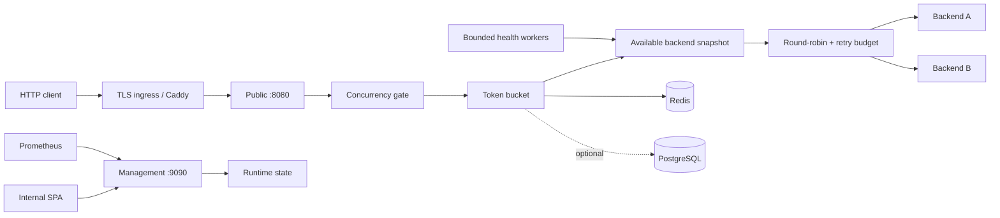

# Go HTTP load balancer

L7 HTTP reverse proxy с round-robin балансировкой, active/passive health checks, ограниченными retry, распределённым token bucket и отдельной management plane. Репозиторий содержит приложение, интерактивную техническую документацию и шаблоны production-развёртывания.

- Интерактивная документация: <https://j0es1ick.github.io/cloud_test_assignment/>
- Public data plane: `:8080`
- Internal management plane: `:9090`
- Локальная live-панель: `:3000`

Проект является одновременно reverse proxy и load balancer: он завершает клиентское HTTP-соединение, создаёт upstream-запрос от своего имени и выбирает backend по состоянию пула. Балансировка — политика выбора upstream; reverse proxy — механизм передачи запроса и ответа.

## Состояние проекта

Production deployment template включает:

- конкурентно-безопасный request path без глобального mutex на выборе backend;
- stable backend ID, runtime replacement и administrative draining;
- streaming responses, client cancellation и HTTP Upgrade/WebSocket forwarding;
- HTTP/HTTPS/TCP health checks с thresholds, jitter, cooldown и slow start;
- retries только на другой backend, только для разрешённых методов и с глобальным process-local retry budget;
- passive circuit breaking и лимит параллельных запросов на backend;
- глобальную overload protection с ограниченной очередью;
- local, Redis и PostgreSQL token bucket storage;
- `fail-open`, `fail-closed` и `local-fallback` при отказе store;
- изолированную management plane, bearer authentication и trusted proxy parsing;
- liveness, readiness, Prometheus metrics, JSON access logs и request ID;
- non-root/read-only контейнеры, локальный TLS edge и observability stack;
- Kubernetes base с тремя репликами, rolling update, HPA, PDB и NetworkPolicy;
- k6 smoke/load/soak/spike профили;
- CI с race detector, integration tests, linters, vulnerability scans и deployment smoke test;
- выпуск multi-architecture OCI-образов с SBOM, provenance, Sigstore-подписью и GitHub attestation.

Это шаблон, а не обещание универсального SLA. Перед реальной публикацией необходимо задать целевые SLO, адреса backend-ов, managed Redis/PostgreSQL, домен, TLS secret, alert receivers и resource limits по результатам нагрузочного теста.

## Архитектура



### Порядок обработки запроса

1. HTTP server применяет header/timeouts и создаёт или сохраняет корректный `X-Request-ID`.
2. IP определяется по socket address. Входные `Forwarded`/`X-Forwarded-*`/`X-Real-IP` не передаются backend-у: цепочка учитывается только от `trusted_proxies`, после чего proxy создаёт канонические заголовки заново.
3. Token bucket атомарно принимает либо отклоняет запрос.
4. Global concurrency gate допускает запрос, ждёт не дольше `queue_timeout` либо возвращает `503`.
5. Round-robin выбирает доступный backend с учётом health, enabled/draining, circuit state и slow-start процента.
6. Backend concurrency limit резервирует slot до закрытия response body.
7. `httputil.ReverseProxy` выполняет upstream attempt через общий tuned transport.
8. Retry возможен только для разрешённого метода, replayable body, другого backend-а и при наличии токена retry budget.
9. Ответ содержит `X-Balancer-Backend`, `X-Balancer-Attempts` и `X-Request-ID`.

### Backend lifecycle

Backend задаётся парой `id` + `url`; ID не вычисляется из hostname. Список доступных backend-ов публикуется как атомарный snapshot.

- Active probe исключает ноду после `failure_threshold` ошибок и возвращает после `success_threshold` успехов.
- Ошибки реального трафика учитываются как passive failures и открывают circuit на `cooldown`.
- `slow_start` постепенно увеличивает долю трафика восстановленной ноды от `slow_start_minimum_percent` до 100%.
- `max_concurrent_requests` ограничивает работу одного backend-а; saturated backend пропускается при выборе.
- Drain отключает новые назначения, сохраняя счётчик уже выполняющихся запросов до закрытия response body.
- Public `write_timeout: 0s` не ставит общий deadline на response body, поэтому SSE, WebSocket и длинные download не обрываются через фиксированное время. Management listener имеет отдельный положительный timeout.
- Graceful shutdown сначала прекращает приём новых соединений и ждёт активные handlers до `shutdown_timeout`.

### Retry semantics

`max_attempts` ограничивает один запрос. `per_try_timeout` ограничивает ожидание response headers, но не обрывает уже начатый streaming/SSE/WebSocket response. `budget_capacity` и `budget_refill_per_second` отдельно ограничивают совокупные дополнительные попытки процесса, чтобы сбой upstream не создавал неограниченное усиление трафика.

По умолчанию повторяются только `GET`, `HEAD`, `OPTIONS`; retry запускается для сетевой ошибки или статуса из `statuses`. Следующая попытка не использует уже выбранный backend. Токен budget расходуется только после успешного резервирования другой ноды. Если альтернативы нет, клиент получает исходный ответ backend-а, например `503`, без ложного `502`. Тело повторяется только при наличии `GetBody` либо когда известный размер полностью помещается в `body_limit`.

Retryable response body не дренируется синхронно: соединение с неуспешным backend-ом закрывается и его контекст отменяется до следующей попытки. Поэтому backend, который отправил заголовки `503` и завис на body, не удерживает retry и два backend-concurrency slot. При сборке upstream URL сохраняются `Path` и `RawPath`: закодированные `%2F`, `%2E` и двойное кодирование не превращаются в другой маршрут.

Внутренний per-try timeout помечается отдельной причиной отмены и считается passive failure backend-а. Отмена самим клиентом распространяется upstream, но не ухудшает health ноды.

Retry budget process-local. При нескольких репликах общий максимум приблизительно равен сумме бюджетов реплик; значения нужно подбирать вместе с replica count и upstream capacity.

### Rate limiter

Bucket хранит дробное число токенов и использует непрерывный refill.

| Store | Атомарность | Область состояния | Назначение |
| --- | --- | --- | --- |
| Redis | Lua script, Redis server time, TTL | все реплики | основной high-throughput профиль |
| PostgreSQL | SQL function, advisory + row lock | все реплики | consistency-first альтернатива |
| Local | mutex на shard, ограниченное число bucket-ов | один процесс | standalone или bounded fallback |

Failure policies:

- `fail-open`: запрос проходит, глобальный лимит временно не гарантируется;
- `fail-closed`: запрос получает `503`, readiness становится отрицательной;
- `local-fallback`: используется локальный bucket; доступность сохраняется, но лимиты реплик временно расходятся.

Redis client подключается лениво: процесс может стартовать при недоступном Redis и следовать выбранной failure policy. После восстановления store следующие операции автоматически возвращаются к распределённому состоянию.

`local_max_buckets` ограничивает память local/fallback store; при заполнении используется приближённое FIFO-вытеснение через фиксированный массив slot-ов. Вставка и вытеснение выполняются за O(1), без полного сканирования shard-а для каждого нового IP. `ipv4_prefix_bits` и `ipv6_prefix_bits` задают агрегацию client key (`/32` и `/64` по умолчанию), поэтому перебор IPv6 interface ID не создаёт новый bucket на каждый адрес. Compose Redis имеет `maxmemory` и `noeviction`: вместо тихого сброса активных квот он возвращает ошибку, которую обрабатывает выбранная failure policy.

## Быстрый локальный запуск

Требования: Docker Desktop с Compose v2.

В командах ниже используется `docker compose`; если установлен отдельный Compose binary, замените его на `docker-compose`.

PowerShell:

```powershell
.\scripts\init-local.ps1
docker compose up --build -d
```

Если Windows зарезервировала стандартные порты, их можно выбрать при инициализации. Скрипт также передаст фактический адрес data plane в live-сборку интерфейса:

```powershell
.\scripts\init-local.ps1 -BalancerPublicPort 18082 -EdgeHttpsPort 18443
docker compose up --build -d
```

Linux/macOS:

```bash
./scripts/init-local.sh
docker compose up --build -d
```

Скрипт создаёт игнорируемые Git файлы `.env` и `deploy/secrets/admin_token.txt` с локальными случайными credentials.

Адреса:

- live console: <http://localhost:3000>;
- data plane: <http://localhost:8080>;
- liveness: <http://localhost:8080/healthz>;
- readiness: <http://localhost:8080/readyz>.

Проверка распределения:

```powershell
1..6 | ForEach-Object { curl.exe -s -D - http://localhost:8080/ -o NUL | Select-String "X-Balancer-Backend" }
```

Остановка без удаления данных Redis:

```powershell
docker compose stop
```

Удаление контейнеров и локальных volumes:

```powershell
docker compose down --volumes
```

### Локальный TLS edge

```powershell
docker compose -f docker-compose.yml -f deploy/compose.edge.yml up --build -d
```

- data plane: <https://localhost:8443>;
- console: `https://console.localhost:8443`.

Caddy использует локальный internal CA. Браузер покажет предупреждение, пока корневой сертификат из volume Caddy не добавлен в локальное trust store. Для реального домена замените host variables и используйте публичный ACME либо TLS, управляемый ingress-платформой.

Порты хоста задаются переменными `BALANCER_PUBLIC_PORT`, `FRONTEND_PORT` и `EDGE_HTTPS_PORT` в локальном `.env`; внутренние порты контейнеров и service discovery при этом не меняются.

### Prometheus, Grafana и Alertmanager

Сначала выполните `scripts/init-local.ps1`, чтобы management token в `.env` совпал с Docker secret.

```powershell
docker compose -f docker-compose.yml -f deploy/compose.observability.yml up --build -d
```

- Grafana: <http://localhost:3001>;
- Prometheus: <http://localhost:9091>;
- Alertmanager: <http://localhost:9093>.

Grafana автоматически получает Prometheus datasource и dashboard `Go load balancer`. Пароль администратора находится в локальном `.env`. Alertmanager использует пустой локальный receiver; production receiver необходимо заменить на webhook/email/PagerDuty-интеграцию.

## Два режима frontend

Frontend расположен в `frontend/` и имеет один codebase.

| Mode | Источник данных | Назначение |
| --- | --- | --- |
| `demo` | модель в браузере | автономная интерактивная документация GitHub Pages |
| `live` | защищённый management API | локальное управление либо read-only диагностика multi-replica deployment |

```powershell
cd frontend
npm ci
npm run dev:demo
# или
npm run dev:live
```

Backend-список строится динамически из status API. В demo можно выбрать от 1 до 8 браузерных нод; в локальном live-режиме тот же селектор вызывает management API и меняет число реально активных nginx upstream-ов. Compose заранее поднимает 8 нод, первые две включены по умолчанию, а health-check проверяет и выключенный резерв. Status также показывает ID обслуживающей реплики.

В Kubernetes `management.runtime_mutations: false`: процесс отклоняет enable/disable, drain, bucket reset и runtime PATCH с HTTP 403. Production-конфигурацию меняют через versioned ConfigMap/Secret и rolling deployment всех реплик. Console и management Service используют `ClientIP` affinity, чтобы одна сессия наблюдала одну реплику; агрегированное состояние кластера смотрят в Prometheus/Grafana. Локальный Compose сохраняет `runtime_mutations: true` и все возможности управления.

GitHub Pages workflow всегда собирает `demo` и задаёт base path `/${repository.name}/`. Статическая страница не обращается к приватному API и работает по HTTPS без mixed content/CORS.

## Конфигурация

Основной локальный файл — `config/config.yaml`. YAML разбирается строго: неизвестные поля считаются ошибкой.

```yaml
server:
  access_log_sample_rate: 0.01 # доля успешных запросов; ошибки логируются всегда
  write_timeout: 0s # без общего deadline для streaming response
  upstream:
    max_concurrent_requests: 512
  retry:
    max_attempts: 2
    per_try_timeout: 5s
    budget_capacity: 100
    budget_refill_per_second: 10
  overload:
    max_concurrent_requests: 2048
    queue_timeout: 50ms

health_check:
  failure_threshold: 2
  success_threshold: 1
  cooldown: 10s
  slow_start: 30s
  slow_start_minimum_percent: 10

rate_limit:
  storage: redis
  failure_mode: local-fallback
  local_max_buckets: 100000
  ipv4_prefix_bits: 32
  ipv6_prefix_bits: 64

management:
  runtime_mutations: true # false для нескольких реплик
  write_timeout: 30s

backends:
  - id: backend-1
    url: http://backend1:80
  - id: backend-3
    url: http://backend3:80
    disabled: true # известен health-check, но не получает трафик до включения
```

Secrets задаются через переменную `NAME` или mounted file `NAME_FILE`. Например, `BALANCER_ADMIN_TOKEN_FILE=/run/secrets/admin_token`. Значение из environment имеет приоритет над file.

### Reload model

`SIGHUP` перечитывает YAML, полностью валидирует новый объект и только затем применяет изменения.

```powershell
docker compose kill -s SIGHUP balancer
```

Динамически изменяются backend list, health policy, slow start, retry policy/budget, rate policy и trusted proxies. Listener addresses, overload semaphore, HTTP timeouts, upstream connection limits и параметры подключения к storage требуют restart.

Runtime management API использует тот же validation/apply path, но не записывает YAML. Флаг `management.runtime_mutations` по умолчанию безопасно выключен, если поле отсутствует; локальный конфиг включает его явно.

## Management API

Management listener не публикуется наружу в базовом Compose/Kubernetes шаблоне. Frontend nginx добавляет bearer credential server-side.

Изменяющие `/api/dashboard/*` запросы дополнительно требуют `Content-Type: application/json` и заголовок `X-Balancer-CSRF: 1`; запросы с `Sec-Fetch-Site: cross-site` отклоняются. Это не позволяет сторонней странице использовать автоматически добавляемый frontend nginx токен как ambient credential. Консольные клиенты должны передавать оба заголовка явно.

| Endpoint | Method | Назначение |
| --- | --- | --- |
| `/api/dashboard/status` | GET | runtime, bucket, backends, circuits, budgets и concurrency |
| `/api/dashboard/request` | GET | запрос через реальный data plane |
| `/api/dashboard/backends` | POST | включить первые `count` нод и выключить остальные |
| `/api/dashboard/backends/{id}` | POST | enable/disable backend |
| `/api/dashboard/backends/{id}/drain` | POST | остановить новые назначения |
| `/api/dashboard/limit` | POST | сбросить bucket текущего client IP |
| `/api/dashboard/config` | PATCH | применить динамические параметры |
| `/metrics` | GET | Prometheus exposition |

Все endpoints, включая metrics и pprof, требуют bearer token, если явно не включён `allow_insecure`.
При `management.runtime_mutations: false` GET endpoints продолжают работать, а все изменяющие endpoints возвращают `403 Forbidden` с указанием использовать декларативный rollout.

## Observability и SLO

Основные metrics:

- `load_balancer_http_requests_total`;
- `load_balancer_http_request_duration_seconds`;
- `load_balancer_upstream_attempts_total`;
- `load_balancer_upstream_duration_seconds`;
- `load_balancer_backend_available`;
- `load_balancer_rate_limit_storage_healthy`;
- `load_balancer_rate_limit_degraded`;
- `load_balancer_rate_limit_local_buckets`;
- `load_balancer_rate_limit_local_evictions_total`;
- `load_balancer_inflight_requests`;
- `load_balancer_protection_events_total`.

Предустановленные alerts отслеживают отсутствие backend-ов, недоступность rate-limit storage, public 5xx ratio, p95 latency, overload/backend saturation и retry-budget exhaustion.

Access log — JSON с `request_id`, listener, method, path, status, duration и client IP. Ошибки (`4xx/5xx`) и management mutations пишутся всегда; успешный трафик семплируется через `server.access_log_sample_rate` (`0` отключает, `1` пишет каждый запрос). Метрики учитывают все запросы независимо от sampling. Логи пишутся в stdout; production-платформа должна собирать их через Fluent Bit, Alloy, Vector или другой агент.

Счётчики и histogram hot path используют `sync.Map`, атомарные counters и короткую блокировку отдельной series вместо одного общего mutex. Scrape сначала получает snapshot и не удерживает request path во время записи медленному Prometheus-клиенту.

Пример начальных SLO, которые владелец сервиса обязан подтвердить:

| SLI | Начальный target |
| --- | --- |
| data-plane availability | 99.9% успешных не-5xx ответов за 30 дней |
| proxy added latency | p95 < 50 ms без учёта backend latency |
| config rollout | 100% ready replicas в течение 10 минут |
| rate store degradation | менее 5 минут в месяц |

## Нагрузочные и failure-тесты

Профили k6 находятся в `load/k6.js`, и у каждого своя проверяемая гипотеза:

- `smoke`, `throughput` (`load` — совместимый alias), `soak`, `recovery` требуют более 99% ответов `200`; `throughput/load` дополнительно требуют `http_reqs` выше `MIN_RPS` (по умолчанию `100`); перед throughput/soak rate limit нужно отключить или поднять выше ожидаемого RPS;
- `rate-limit` требует увидеть и `200`, и переход в `429`, не допуская `503`;
- `overload` и `spike` требуют увидеть и полезные `200`, и управляемые `503`, не принимая произвольные статусы за успех.

Таким образом, один разрешённый `429/503` больше не может сделать обычный load/soak тест зелёным. Если передать `EXPECTED_BACKENDS=backend-1,backend-2`, k6 дополнительно требует хотя бы один успешный ответ от каждой перечисленной ноды и отклоняет ответы из другого пула. CI запускает smoke, включает все 8 локальных upstream-ов для строгого throughput, проверяет распределение по ним и отдельно проверяет rate-limit transition; длительный soak и overload/recovery выполняются перед выпуском на среде с нужным профилем конфигурации.

```powershell
docker run --rm --network host `
  -v "${PWD}/load:/scripts:ro" `
  grafana/k6:1.7.1 run `
  -e TARGET_URL=http://127.0.0.1:8080 `
  -e PROFILE=smoke `
  /scripts/k6.js
```

Для Windows Docker Desktop вместо host network можно использовать `TARGET_URL=http://host.docker.internal:8080`.

Для target-specific throughput gate передайте, например, `-e PROFILE=throughput -e MIN_RPS=500`. Значение фиксируется по baseline целевой среды, а не подбирается после неудачного теста.

Локальный single-backend failure scenario:

```powershell
.\scripts\chaos-local.ps1
```

Скрипт останавливает `backend1`, проверяет продолжение трафика через вторую ноду и всегда запускает первый backend обратно. Для production sizing генератор нагрузки должен работать на отдельной машине.

Microbenchmarks:

```powershell
go test -run '^$' -bench='Benchmark(RoundRobinStrategy|LocalStoreTake)$' -benchmem ./internal/...
```

Контрольный запуск 3 августа 2026, Windows/amd64, Intel Core i7-12700H:

| Benchmark | ns/op | B/op | allocs/op |
| --- | ---: | ---: | ---: |
| RoundRobinStrategy | 20.46 | 0 | 0 |
| LocalStoreTake | 69.34 | 0 | 0 |

Microbenchmark не является обещанием end-to-end RPS: итог определяют сеть, payload, backend latency и выбранный store.

## Kubernetes production template

Base находится в `deploy/kubernetes/base`.

Перед применением:

1. Замените `OWNER/REPOSITORY` и tag в `kustomization.yaml`.
2. Замените backend, Redis/PostgreSQL addresses и trusted proxy ranges в `configmap.yaml`.
3. Замените `balancer.example.com` и TLS secret в `ingress.yaml`.
4. Создайте `balancer-secrets` через External Secrets/Sealed Secrets/Vault либо временно на основе `secret.example.yaml`.
5. Пометьте namespace ingress controller label `networking.k8s.io/ingress-controller=true` либо адаптируйте NetworkPolicy.
6. Настройте resource requests/limits по результатам k6/soak test.
7. Если выбран PostgreSQL store, сначала примените optional migration Job из инструкции ниже.

```bash
kubectl apply -f deploy/kubernetes/secret.yaml
kubectl apply -k deploy/kubernetes/base
kubectl -n load-balancer rollout status deployment/balancer
```

Console намеренно не имеет public Ingress:

```bash
kubectl -n load-balancer port-forward svc/balancer-console 3000:80
```

Панель в этом режиме read-only. Она показывает одну закреплённую реплику и динамический список её backend-ов. Изменение `ConfigMap` выполняется через Git/CI или `kubectl apply`, после чего `rollout status` подтверждает обновление всех pod-ов.

Для Prometheus Operator отдельно примените `deploy/kubernetes/optional/servicemonitor.yaml` и обеспечьте доступ его namespace через NetworkPolicy.

Template предполагает managed Redis/PostgreSQL и ingress controller. Он не пытается эмулировать высокую доступность stateful-сервисов внутри одного кластера или одного Compose host.

NGINX Ingress read/send timeout установлен в `3600s`, чтобы не обрывать idle SSE/WebSocket раньше Go data plane. Приложение всё равно должно отправлять heartbeat чаще этого интервала; если используется другой ingress controller или cloud load balancer, его idle timeout настраивается отдельно.

### Rollout и rollback

Deployment использует `maxUnavailable: 0`, `maxSurge: 1`, startup/readiness probes, `preStop` и 45-секундный termination grace period.

```bash
kubectl -n load-balancer set image deployment/balancer balancer=IMAGE@sha256:DIGEST
kubectl -n load-balancer rollout status deployment/balancer --timeout=10m
kubectl -n load-balancer rollout undo deployment/balancer
```

До promotion выполните smoke profile, проверьте alerts, p95/p99, 5xx ratio, retry budget и store health. Конфигурация должна быть versioned вместе с image digest.

## CI/CD и supply chain

Workflow выполняет:

1. `gofmt`, module consistency, race/unit/integration tests;
2. `go vet`, Staticcheck, `govulncheck` и microbenchmarks;
3. npm audit и обе frontend-сборки;
4. Compose и Kustomize validation;
5. Gitleaks и Trivy HIGH/CRITICAL scan;
6. полный Compose startup, k6 smoke, throughput по восьми upstream-ам и проверку перехода rate limiter из `200` в `429`;
7. GitHub Pages deploy для `master`;
8. release по tag `v*`: multi-arch GHCR images, BuildKit SBOM/provenance, keyless Cosign signature и GitHub attestation.

Проверка опубликованного образа:

```bash
cosign verify \
  --certificate-identity-regexp '^https://github.com/OWNER/REPOSITORY/' \
  --certificate-oidc-issuer https://token.actions.githubusercontent.com \
  ghcr.io/OWNER/REPOSITORY-balancer@sha256:DIGEST
```

Production deployment должен использовать digest, а не изменяемый tag.

## Security model

- Public и management listeners разделены.
- Management credential отсутствует в image, YAML и Git; поддерживаются environment и mounted secret files.
- Frontend добавляет credential на серверной стороне, поэтому токен не попадает в JS bundle.
- Management mutations требуют JSON и отдельный CSRF-заголовок; cross-site browser requests отклоняются до выполнения handler-а.
- Redis, management API и backends не публикуются на host в Compose.
- Kubernetes console остаётся ClusterIP без публичного Ingress.
- Containers используют non-root user, read-only root filesystem, dropped capabilities и `no-new-privileges`/seccomp.
- Client IP headers доверяются только явно заданным proxy ranges; перед upstream входные forwarding headers удаляются и создаются заново из проверенного адреса.
- TLS завершается внешним ingress/Caddy; upstream HTTPS требует нормальную CA chain.
- CI сканирует secrets, Go/npm dependencies и runtime image.

Для реального production дополнительно нужны namespace/RBAC policy, external secret manager с rotation, registry retention, audit storage, firewall/WAF по модели угроз и регулярная проверка restore/rollback.

## Failure matrix

| Событие | Data plane | Readiness | Наблюдаемость |
| --- | --- | --- | --- |
| Один backend недоступен | retry на другую ноду, circuit open | ready при наличии другой ноды | attempt/error, backend gauge |
| Все backend-ы недоступны | `503` | `503` | backend gauges = 0 |
| Backend saturated | выбирается другая нода либо `503` | зависит от health, не saturation | protection event |
| Global concurrency исчерпан | после queue timeout `503` | ready | overload protection event |
| Retry budget исчерпан | возвращается текущая ошибка без новой попытки | ready | retry-budget event |
| Redis недоступен + local fallback | локальный limiter | ready | storage healthy = 0, degraded = 1 |
| Store недоступен + fail-closed | `503` | `503` | storage healthy = 0 |
| Ошибка нового YAML | старая config продолжает работать | без изменений | structured reload error |
| Неверный management token | public не затронут, management `401` | без изменений | management access log |

## PostgreSQL migrations и backup

PostgreSQL store применяет embedded numbered migrations транзакционно и записывает версии в `schema_migrations`. Session-level advisory lock сериализует миграции даже при одновременном старте нескольких реплик.

Для Kubernetes используйте отдельный Job до rollout. ConfigMap к этому моменту должен содержать `rate_limit.storage: postgres`, а image должен совпадать с новой версией Deployment:

```bash
kubectl apply -f deploy/kubernetes/optional/postgres-migration-job.yaml
kubectl -n load-balancer wait --for=condition=complete job/balancer-postgres-migrate --timeout=5m
kubectl apply -k deploy/kubernetes/base
```

Job устанавливает `MIGRATE_ONLY=true`: процесс подключается к PostgreSQL, применяет схему и завершается, не открывая HTTP listeners. Автоматическая проверка миграций при обычном старте сохранена как страховка и использует тот же глобальный lock.

Bucket state не является бизнес-данными и может быть восстановлен пустым после TTL. Если PostgreSQL используется совместно с другими данными, backup/restore policy определяет владелец базы; сам балансировщик не должен владеть кластерным backup lifecycle.

## Проверки разработчика

```powershell
go test -race -count=1 ./...
go vet ./...
go run honnef.co/go/tools/cmd/staticcheck@v0.7.0 ./...

cd frontend
npm ci
npm audit --audit-level=high
npm run build:live
npm run build:demo
```

Integration tests используют `TEST_REDIS_ADDRESS`, `TEST_POSTGRES_HOST` и `TEST_POSTGRES_PASSWORD`; без этих переменных они пропускаются локально, но выполняются в CI с реальными service containers.

## Структура репозитория

```text
cmd/balancer/                 process lifecycle and reload
internal/balancer/            pool, health, retries and protection
internal/ratelimit/           local/Redis/PostgreSQL token bucket
internal/server/              public and management HTTP planes
internal/observability/       Prometheus exposition
frontend/                     live/demo SPA and nginx
config/                       local configuration
deploy/                       edge, observability and Kubernetes templates
load/                         k6 profiles
scripts/                      local initialization and failure tests
.github/workflows/            quality, security, Pages and OCI releases
```

## Явные границы

Проект не пытается заменить Envoy, HAProxy или облачный managed load balancer. В нём нет xDS, HTTP/3, mTLS identity plane, геораспределённого consensus control plane и автоматического discovery из произвольных orchestration APIs. Отдельный distributed control plane намеренно не добавлен: для этого масштаба декларативный ConfigMap rollout проще, понятнее и надёжнее.

Production readiness относится к конкретной среде. Репозиторий предоставляет безопасный deployment template и проверяемые механизмы, но фактическая готовность определяется результатами load/soak/chaos tests, выбранным SLA, качеством managed dependencies и операционными процедурами команды.
